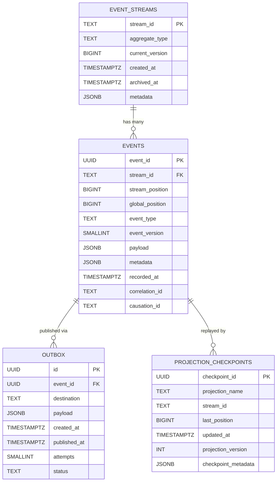
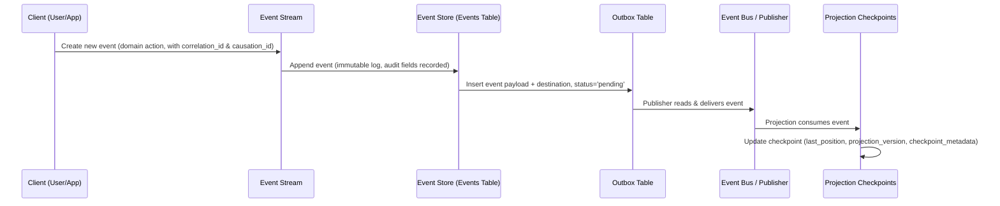
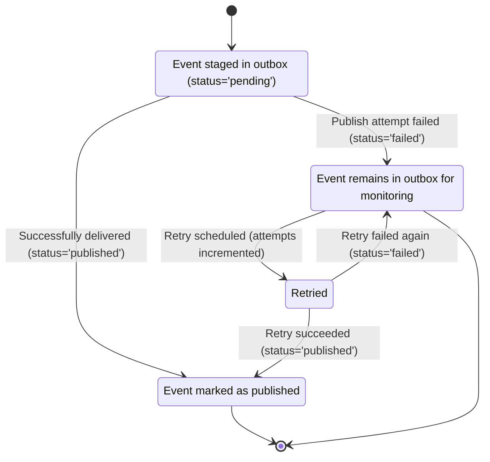
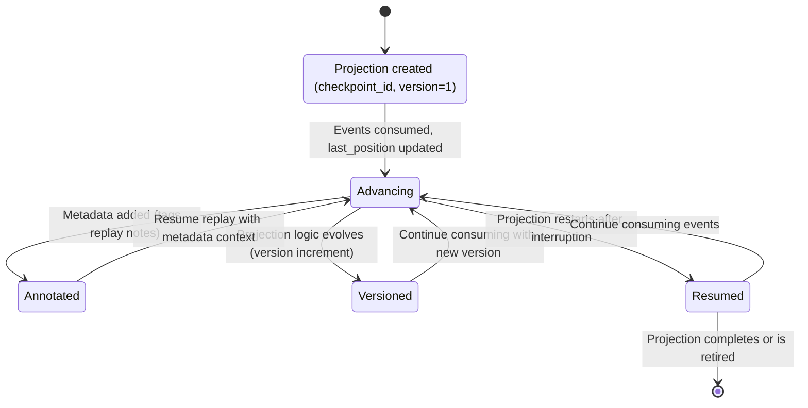
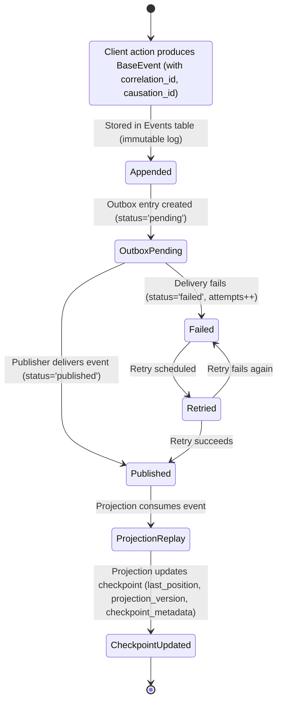

# Design Rationale: Event Store & Audit Infrastructure

## Event Streams

- **stream_id** → Unique identifier for each aggregate stream (e.g., one loan application). Guarantees events are grouped correctly.  
- **aggregate_type** → Domain entity type (e.g., `Application`, `Document`). Helps projections and debugging.  
- **current_version** → Tracks the latest version for optimistic concurrency control. Prevents conflicting writes.  
- **created_at** → When the stream was first created. Supports audit trails.  
- **archived_at** → Marks when a stream is closed or retired. Enables lifecycle management.  
- **metadata** → Flexible JSON for stream-level attributes (tags, owner info). Keeps schema extensible.

---

## Events

- **event_id** → Unique identifier for each event. Ensures immutability and traceability.  
- **stream_id** → Links event to its stream. Maintains grouping and replay integrity.  
- **stream_position** → Position within the stream. Guarantees ordering for replay.  
- **global_position** → Monotonic sequence across all events. Enables global ordering and checkpointing.  
- **event_type** → Domain event name (e.g., `ApplicationSubmitted`). Drives projections and business logic.  
- **event_version** → Schema version of the payload. Supports upcasting when payload evolves.  
- **payload** → The actual event data. Stored as JSON for flexibility across event types.  
- **metadata** → Extra info (tags, headers). Supports observability and debugging.  
- **recorded_at** → Timestamp when the event was recorded. Ensures audit accuracy.  
- **correlation_id** → Explicit field linking related events across streams. Critical for tracing workflows.  
- **causation_id** → Explicit field linking back to the event that triggered this one. Enables causal chains.  
- **uq_stream_position** → Constraint preventing duplicate positions in a stream. Critical for consistency.

---

## Outbox

- **id** → Unique identifier for the outbox entry.  
- **event_id** → References the event being published. Enforces consistency between event store and outbox.  
- **destination** → Target system/channel (e.g., `event_bus`, `kafka`). Required for routing.  
- **payload** → Copy of the event payload. Ensures publisher can work independently of the event store.  
- **created_at** → When the outbox entry was created. Useful for retry scheduling.  
- **published_at** → When the event was successfully published. Supports monitoring and SLA tracking.  
- **attempts** → Number of publish attempts. Enables retry logic and dead-letter handling.  
- **status** → Explicit state (`pending`, `published`, `failed`). Aligns with OutboxStatus enum for reliable monitoring.

---

## Projection Checkpoints

- **checkpoint_id** → Unique identifier for each checkpoint row. Supports multiple checkpoints per projection.  
- **projection_name** → Identifier for each projection (e.g., `LoanSummaryView`).  
- **stream_id** → Optional, if the projection replays events per stream.  
- **last_position** → Last global_position processed. Ensures projections resume correctly.  
- **updated_at** → When the checkpoint was last updated. Useful for monitoring replay progress.  
- **projection_version** → Versioning for evolving projections. Supports schema changes in projection logic.  
- **checkpoint_metadata** → Flexible JSON for checkpoint-level attributes (tags, replay notes). Keeps schema extensible.

---

## Indexes

- **idx_events_stream_id** → Speeds up stream replay queries.  
- **idx_events_global_pos** → Optimises global ordering queries for projections.  
- **idx_events_type** → Useful for filtering by event type (e.g., analytics).  
- **idx_events_recorded** → Enables time-based queries (e.g., audit reports).

---

## Diagrams

### Static Structure (Schema Overview)

- **Event Streams** group events by aggregate, enforcing version control and lifecycle management.
- **Events** form an immutable, append-only log with both stream-local and global ordering.
- **Outbox** ensures reliable publishing by staging events for downstream delivery, with retry and monitoring built in.
- **Projection Checkpoints** track replay progress, enabling projections to resume seamlessly after interruptions.
- **Indexes** optimise queries for replay, analytics, and audit reporting.
  
(See ER diagram for table relationships.)

### Runtime Flow (Sequence Diagram)

- A client action creates a new domain event, including correlation/causation IDs.
- The event is appended immutably to the event store with explicit audit fields.
- The outbox captures the event payload, destination, and sets status to `pending`.
- A publisher reads from the outbox and delivers the event to the event bus.
- Projections consume the event, update their state, and persist checkpoints with versioning and metadata.
  
(See sequence diagram for lifecycle flow.)

### Reliability States (Outbox State Diagram)

- **Pending**: Event staged for publishing, status=`pending`
- **Published**: Successfully delivered; `status='published'`, `published_at` recorded.
- **Failed**: Delivery attempt failed; `status='failed'`, `attempts` incremented.
- **Retried**: System retries publishing until success or dead-letter handling.dead-letter handling.

(See state diagram for outbox lifecycle.)

---

### Checkpoint Lifecycle (Projection State Diagram)

- **Initialised**: A new projection starts with a `checkpoint_id`, `projection_name`, and `projection_version=1`.  
- **Advancing**: As events are consumed, `last_position` is updated and `updated_at` refreshed.  
- **Versioned**: When projection logic changes, `projection_version` increments. This ensures replay consistency.  
- **Annotated**: `checkpoint_metadata` stores replay notes, tags, or diagnostic info.  
- **Resumed**: On restart, the projection resumes from the last known `last_position` and version.  

---

### End‑to‑End Lifecycle (Combined State + Flow)

The event store acts as the central ledger of all domain activity. When a client action occurs, it creates a new event that is immutably recorded with audit fields like correlation and causation IDs. Each event is staged in the outbox with a status of `pending`, ensuring reliable delivery to downstream systems. The publisher reads from the outbox, attempts delivery, and updates the status to `published` or `failed` depending on the outcome. Failed events can be retried until successful or flagged for monitoring. Projections consume published events to build query‑friendly views, and each projection maintains a checkpoint with its own version and metadata. This checkpoint ensures that if the system restarts, projections can resume from the exact position they left off, even as projection logic evolves. Together, these components guarantee consistency, auditability, and resilience across the entire event‑driven infrastructure.

