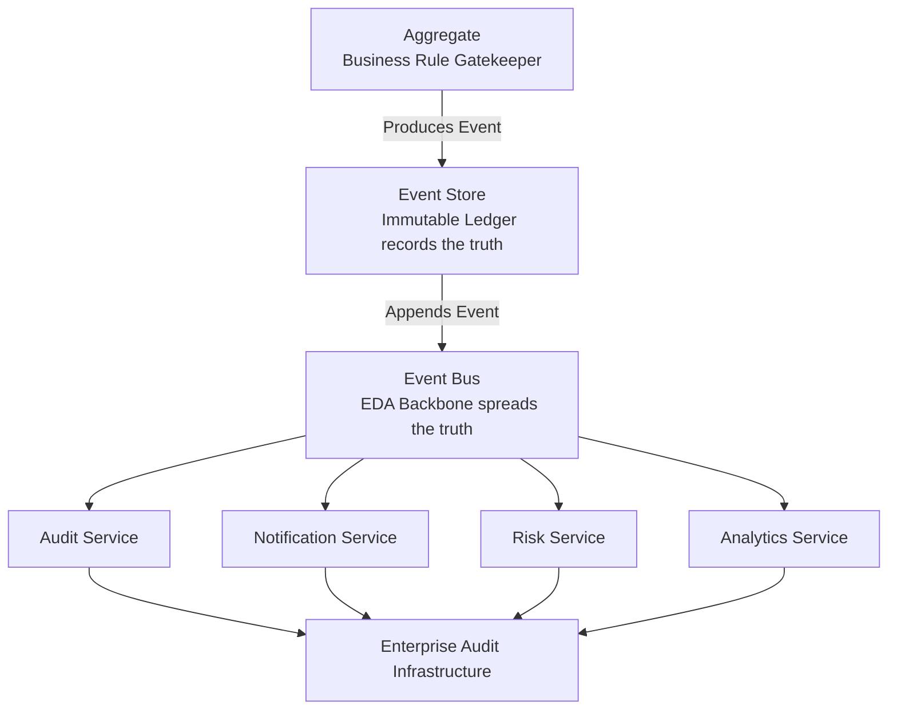
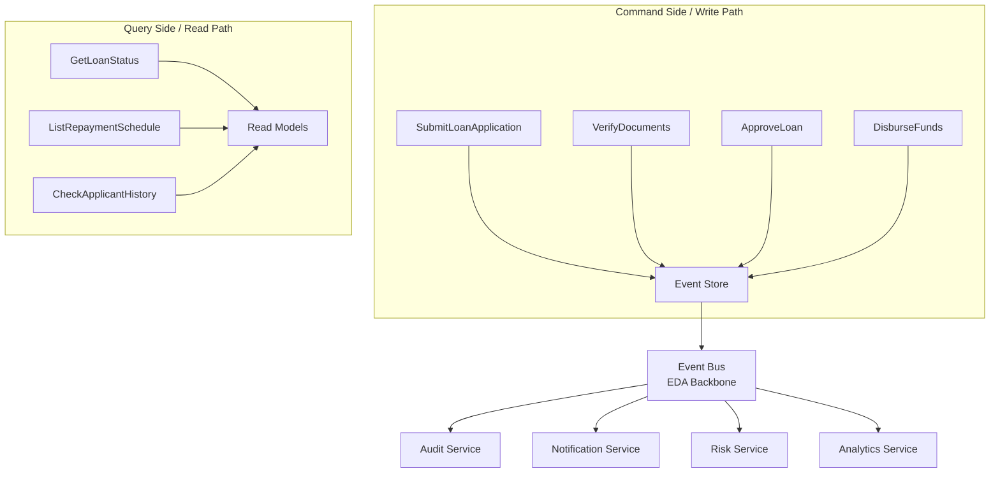
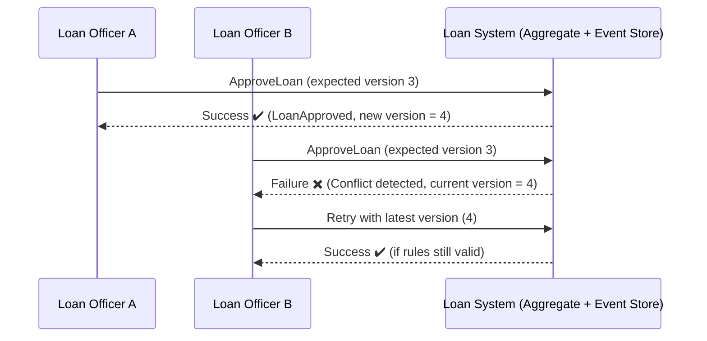
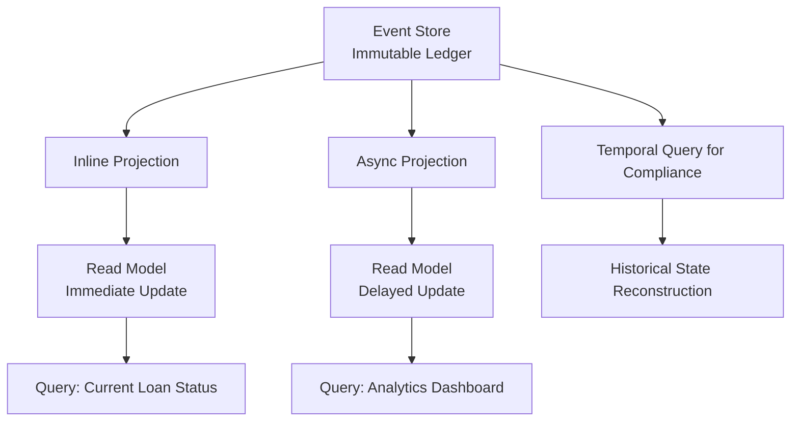
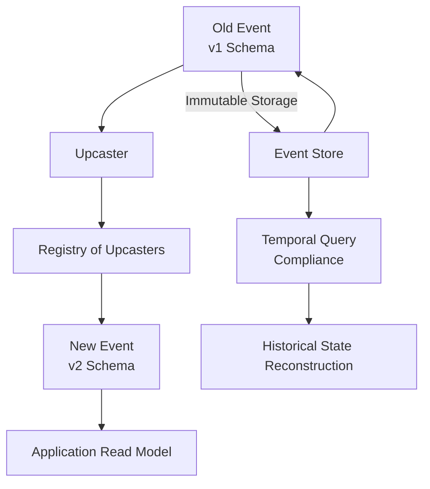
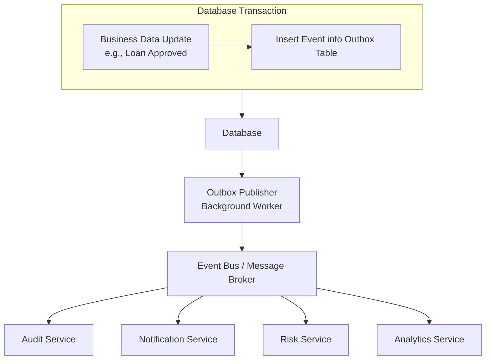
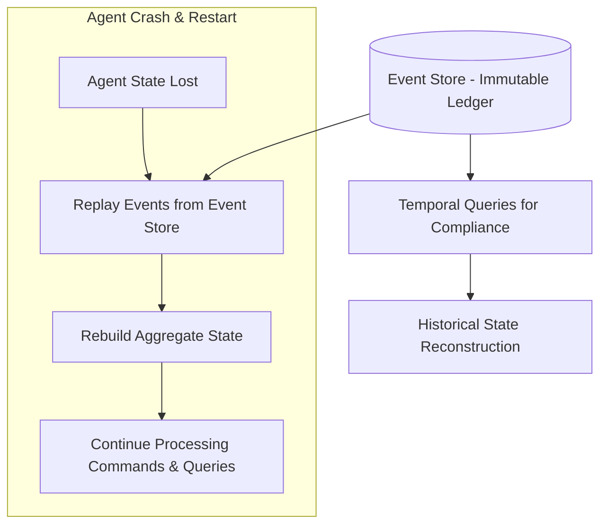

# Domain Notes — Phase 0: Reconnaissance

## 1. Event Sourcing vs Event‑Driven Architecture

- **Event Sourcing (ES)**:  
  - **Definition**: Event sourcing is a way of storing data where, instead of saving just the latest state of something, every change (or "event") that happened to it is saved. ES captures the full history while tradiditnal storage takes snapshot of the curent state.

  - **Key properties**:
    - **Events as the source of truth**: Every change is stored as an immutable event (e.g., “User updated profile,” “Invoice paid”). The system doesnot overwrite data; it appends new events.
    - **Immutable history**: Once recorded, events are never altered or deleted. This ensures a trustworthy, tamper-proof record of what happened
    - **Rebuildable state**: The current state of any entity can be reconstructed by replaying its events in order. This makes the system resilient and transparent.
    - **Time-travel capability**: The state of the system can be recrated at any point in the past, which is crucial for investigations, compliance checks, or debugging.
    - **Audit-friendly structure**: Events naturally form a chronological log, providing a complete trail of actions and decisions.

  - **Why it matters for audit infrastructure**: ES's approach is powerful because it gives an exact audit trail, which makes debugging easier, and allows to recreate past states whenever needed.
    - **Transparency & Accountability**: Auditors can see not just the final state but *how* it was reached, step by step.
    - **Compliance**: Many industries (finance, healthcare, government) require provable histories of data changes. Event sourcing provides this out-of-the-box.
    - **Forensics & Investigation**: If something goes wrong, it can replay events to understand exactly what happened and when.
    - **Non-repudiation**: Because events are immutable, users and systems cannot deny that an action took place once it is recorded.
    - **Enterprise resilience**: In large organisations, audit infrastructure built on event sourcing ensures consistency across distributed systems and makes regulatory reporting easier.

In short: **Event sourcing turns a data store into a trustworthy ledger of everything that happened**, which is exactly what enterprises need for strong audit and compliance systems.

- **Event‑Driven Architecture (EDA)**:  
  - **Definition**: Event-Driven Architecture (EDA) is a way of designing systems where things happen in response to events rather than following a fixed step-by-step process.
  
  - **Key properties**:
    - **Events trigger actions**: Systems donot constantly check for changes; they react when something happens.  
    - **Loose coupling**: Components do not need to know much about each other, they just listen for events.  
    - **Scalability**: Easy to add new listeners or services without changing the core system.  
    - **Real-time responsiveness**: Perfect for systems that need to react quickly (e.g., fraud detection, IoT devices).  
  
  - **Why It Matters for Audit & Enterprise Systems**:
    - **Traceability**: Every event is logged, so it is known exactly what happened and when.  
    - **Flexibility**: New audit rules or compliance checks can be added as listeners without redesigning the whole system.  
    - **Reliability**: If one part fails, others can still process events independently.  
    - **Transparency**: Auditors can follow the chain of events to see how a decision or state was reached.  

  In short: **EDA makes systems more responsive and auditable by treating every change as an event that can be tracked, reacted to, and analysed.**

  - **How EDA differs from ES**:  
    - **Es** ensures a ledger is trustworthy and records *what happened* and *when*.  
    - **EDA** ensures that every relevant system reacts to those events, making compliance checks, alerts, and monitoring automatic.  
    - Together, they create an enterprise system that is both **transparent** (has proven history) and **responsive** (that can act on events as they happen).

  In short: **Event Sourcing is about recording the truth while Event‑Driven Architecture is about responding to the truth.**

| Aspect | **Event Sourcing (ES)** | **Event‑Driven Architecture (EDA)** |
| --- | --- | --- |
| **Core Idea** | Store every change as an immutable event. | Build systems that react to events in real time. |
| **Focus** | Data persistence and history. | System communication and responsiveness. |
| **Analogy** | A diary that records every action so history can be replayed. | A restaurant where each staff member reacts when an order (event) happens. |
| **State Management** | Current state is rebuilt by replaying events. | State is updated immediately when events are consumed. |
| **Audit Value** | Provides a complete, tamper‑proof log of all changes. | Provides traceability of how different services reacted to events. |
| **Use Cases** | Banking ledgers, healthcare records, compliance systems. | IoT systems, fraud detection, real‑time notifications, microservices. |
| **Relationship** | Event sourcing produces the events. | EDA consumes and reacts to those events. |

---

## 2. Aggregates

- **Definition**: An **Aggregate** is a cluster of related objects (entities and value objects) that are treated as a single unit when enforcing business rules.  It has a **root entity** (called the *Aggregate Root*) that controls access to the rest of the objects inside.  Aggregates **define clear boundaries** around complex processes (loan lifecycle, agent workflows). They **enforce rules consistently**, preventing invalid states (e.g., approving a loan without documents, or an agent acting without authorisation). They **produce meaningful events** (`LoanApproved`, `PaymentLate`, `TaskExecuted`) that feed into **Event Sourcing** and **Event‑Driven Architecture**, ensuring both **auditability** and **real‑time responsiveness**.

- **Examples**:  
  - **Order Aggregate**  
    - **Aggregate Root**: `Order`  
    - **Entities inside**: `OrderLine`, `Payment`, `Shipment`  
    - **Business Rules enforced**:  
      - Items cannot be added to an order once it is marked “Shipped.”  
      - Payment must be completed before shipment is created.  
      - Only the `Order` (root) decides if changes are allowed.
  - **Bank Account Aggregate**  
    - **Aggregate Root**: `BankAccount`  
    - **Entities inside**: `Transaction`, `Balance`  
    - **Business Rules enforced**:  
      - Withdrawal more than the available balance is impossible.  
      - Every deposit/withdrawal must be recorded as a transaction.  
      - Only the `BankAccount` root ensures rules like overdraft protection.
  - **LoanApplication Aggregate**
    - **Aggregate Root**: `LoanApplication`
    - **Entities inside**: `ApplicantDetails`, `CreditScore`, `SupportingDocuments`
    - **Business Rules enforced**:
      - Application cannot move to “Approved” until all required documents are submitted.  
      - Credit score must meet minimum threshold before approval.  
      - Once marked “Rejected,” no further edits are allowed.  
  - **LoanRepayment Aggregate**
    - **Aggregate Root**: `RepaymentSchedule`
    - **Entities inside**: `Installment`, `PaymentRecord`
    - **Business Rules enforced**:
      - Payments must follow the schedule (no skipping installments).  
      - Late payments trigger penalty events.  
      - Overpayment is applied to principal, not ignored.
  - **AIWorkflow Aggregate**
    - **Aggregate Root**: `WorkflowAgent`
    - **Entities inside**: `Task`, `Decision`, `ActionLog`
    - **Business Rules enforced**:
      - Agent cannot execute a task unless prerequisites are complete.  
      - Decisions must be logged before actions are taken (audit trail).  
      - Tasks cannot be reassigned once marked “Completed.”  
  - **AgentAuthorisation Aggregate**
    - **Aggregate Root**: `AgentIdentity`
    - **Entities inside**: `Permissions`, `AccessTokens`
    - **Business Rules enforced**:
      - Agent cannot perform actions outside its assigned permissions.  
      - Expired tokens must block execution.  
      - Only the root (`AgentIdentity`) can grant or revoke access.  

- **Role in enforcing business rules**:  
  - **Consistency boundary**: Aggregates ensure that rules are applied correctly within their scope.  
  - **Controlled access**: Only the Aggregate Root exposes operations; other parts are hidden to prevent invalid changes.  
  - **Transaction safety**: Business rules are enforced at the aggregate level, so that there will be no partial or inconsistent states.  
  - **Audit alignment**: Since aggregates define clear boundaries, events recorded from them (in event sourcing) are meaningful and traceable for compliance.

In short: **Aggregates are like guardians of business rules**, they group related data and enforce rules so that the system stays consistent and auditable.

---

## 3. CQRS (Command Query Responsibility Segregation)

- **Definition**: CQRS is a design pattern that **separates the way data is updated (commands)** from the way it is **read (queries)**. Instead of one model handling both reads and writes, it is split into two distinct parts. This makes systems more scalable, flexible, and easier to audit.

- **How commands work**:  **Commands = “Do something”**  They represent actions that change the system’s state.  
  - Examples:  
    - `SubmitLoanApplication`  
    - `ApproveLoan`  
    - `WithdrawFunds`  
  - Commands go through **business rules** (often enforced by Aggregates) before being accepted. If valid, they produce **events** (e.g., `LoanApproved`) that are stored in the Event Store.

- **How queries work**: **Queries = “Show me something”** They retrieve data without changing it.  
  - Examples:  
    - `GetLoanStatus`  
    - `ListRepaymentHistory`  
    - `CheckAccountBalance`  
  - Queries are optimised for fast reads and can use specialised read models (like denormalised views or caches).

- **Benefits of separation**:  
  - **Scalability**: Reads and writes can be scaled independently. For example, a system with millions of queries but fewer commands can optimise resources.  
  - **Performance**: Queries can be tailored for speed (e.g., precomputed views), while commands focus on correctness and business rules.  
  - **Auditability**: Commands produce events that are stored immutably, making it easy to trace changes.  
  - **Flexibility**: Different teams can evolve read and write models separately without interfering.  
  - **Security**: Commands enforce strict rules, while queries only expose safe, read‑only data.

In short: **Commands, change the system (write path).** **Queries, read the system (read path).** **CQRS, split them apart for clarity, scalability, and auditability.**

---

## 4. Optimistic Concurrency

- **Definition**: Optimistic occuerency is a way of handling situations where multiple people or processes might try to update the same data at the same time. Instead of locking the data and blocking others, the system **assumes (“optimistically”) that conflicts are rare**. If a conflict does happen, it is detected and handled after the fact.

- **Mechanism (version numbers, event streams)**:
  1. **Version Numbers**  
     - Each record or aggregate has a version number (like `v1`, `v2`, `v3`).  
     - When updating the record, one says: *“I am updating version 3.”*  
     - If the record is still at version 3, the update succeeds and becomes version 4.  
     - If someone else already updated it to version 4, the update fails — one must retry with the latest version.
  
  2. **Event Streams (in Event Sourcing)**  
     - Each aggregate has a stream of events (`LoanSubmitted`, `LoanApproved`, etc.).  
     - When there is an append to a new event, the expected last event number is specified.  
     - If the stream has moved ahead (someone else added an event), the append fails.  
     - This prevents overwriting or losing events.

- **Why it is preferable to locking**:  
  - **No blocking**: With locks, if one user holds the lock, others must wait. Optimistic concurrency lets everyone try, and only rejects conflicting updates.  
  - **Better performance**: Especially in distributed systems, locks can slow things down or cause deadlocks. Optimistic concurrency avoids that.  
  - **Scalability**: Works well when conflicts are rare (which is true in many real-world systems).  
  - **Audit-friendly**: In event sourcing, failed updates are visible, and retries are part of the traceable history.  
  - **User experience**: Instead of waiting, users get immediate feedback if their update conflicts, and can retry with fresh data.

In short: **Optimistic Concurrency** means *“Go ahead and try; if someone else changed it first, we will catch it and retry.”* It uses **version numbers or event stream positions** to detect conflicts. It is **faster, safer, and more scalable** than locking, especially in event-driven, audit-heavy systems.

Example:

---

## 5. Projections

- **Definition**: A **Projection** is a way of **transforming raw events into a useful view or model**. Since event sourcing stores every change as an event (`LoanSubmitted`, `LoanApproved`, etc.), projections lets **rebuild state** or **create read models** from those events. Think of it as: *“Take the history of events and project them into a current picture.”*
  
- **Inline projections**:
  - Events are processed **immediately** as they are written.  
  - The read model is updated in the same transaction.  
  - **Benefit**: Strong consistency, the read model is always up to date.  
  - **Drawback**: Can slow down writes, because every event must update the projection right away.

- **Async projections**:
  - Events are processed **later**, often by background workers or subscribers.  
  - The read model may lag behind the latest events.  
  - **Benefit**: Faster writes, more scalable.  
  - **Drawback**: Temporary latency, queries may show slightly outdated data.  

- **Trade‑offs (latency vs consistency)**:
  - **Inline** = low latency for reads, high consistency, but slower writes.  
  - **Async** = faster writes, scalable, but queries may see stale data until projections catch up.  
  - The choice depends on whether the system values **real‑time accuracy** (e.g., financial transactions) or **performance and scalability** (e.g., analytics dashboards).  

- **Compliance needs (temporal queries)**:  
  - In audit systems, projections are critical because auditors often need **temporal queries**:  
    - *“What was the loan status on March 1st?”*  
    - *“Who approved this application before disbursement?”*  
  - Projections can be built to show **state at any point in time**, not just the latest.  
  - This ensures compliance teams can reconstruct history exactly as it was, proving rules were enforced.

In short: **Projections are turning event history into useful views.** **Inline is immediate updates, consistent but slower.** **Async is delayed updates, faster but less consistent.** **Compliance is projections enable temporal queries to prove what happened when.**

---

## 6. Upcasting

- **Definition**: In **event sourcing**, every change is stored as an event. But over time, the **event schema** (the structure of events) may evolve — one might add new fields, rename attributes, or change formats. **Upcasting** is the process of **transforming old events into the new schema format** when they are read, so the system can still understand them. Think of it like upgrading old VHS tapes into digital format so they can still be played today.

- **How schema evolution is handled**:  
  - **Old events remain immutable** — history cannnot be rewritten. Instead, when they are loaded they are **upcast** into the new shape.  
  - Example:  
    - Old event: `LoanApproved { loanId, amount }`  
    - New schema: `LoanApproved { loanId, amount, approvedBy }`  
    - Upcaster adds a default `approvedBy = "System"` if missing.

- **Registry‑based approach**:
  - Upcasters are often managed in a **registry**. Each event type has a chain of upcasters that know how to transform older versions into the latest schema. This ensures consistency: whenever an event is read, it is automatically upgraded before being processed.

- **Importance of immutability**:  
  - **Events are never changed in storage.** Immutability guarantees that the historical record is trustworthy.  
  - Upcasting happens only at **read time**, so auditors can always see the original event and the transformed version.  
  - This balance preserves compliance while allowing systems to evolve.
  - **Flexibility**: Systems can evolve without breaking old data.  
  - **Compliance**: Auditors can still query the exact historical event stream.  
  - **Consistency**: Applications always work with the latest schema, even if events were written years ago.  

In short: **Upcasting is upgrading old events into the new schema at read time.** **Schema evolution** is handled by upcasters, often managed in a registry. **Immutability** ensures history is never rewritten, keeping compliance intact.

Example:

---

## 7. Outbox Pattern

- **Definition**: It is a technique used in event-driven systems to ensure that **events are reliably published** whenever a change happens in the database. The idea: *“Write the data change and the event describing it into the same database transaction.”*  Later, a background process reads the “outbox” table and publishes the event to the message broker (like Kafka or RabbitMQ).

- **How it ensures reliable event publishing**:
  1. **Transaction Step**  
     - When a business data is updated (e.g., approve a loan), a record is also inserted into the **Outbox table** in the same transaction.  
     - Example:  
       - Update loan status → `Approved`  
       - Insert event → `LoanApproved` into Outbox.
  2. **Publisher Step**  
     - A background worker scans the Outbox table.  
     - It publishes each event to the event bus/message broker.  
     - Once published, the event is marked as “sent” in the Outbox.

- **Why it prevents “lost events” problem**:  
  - Without the Outbox, the database migh be updated but fail to publish the event (e.g., crash between steps). With the Outbox, both the data change and the event record are committed together. Even if the system crashes, the event is still in the Outbox table and will be published later. This guarantees **no lost events** and keeps the database and event bus in sync.

  - **Benefits**
    - **Reliability**: Ensures events are never lost.  
    - **Consistency**: Database state and published events always match.  
    - **Auditability**: Outbox table provides a traceable record of what was published.  
    - **Scalability**: Works well in distributed systems where failures are common.

In short: **Outbox Pattern = write data + event together, publish later.** It ensures reliable event publishing and prevents the dreaded **“lost events” problem**.

---

## 8. Gas Town Pattern

- **Definition**: It is a resilience pattern used in **event‑sourced systems**. The idea: if an agent (like a service or microservice) crashes or loses state, it can **reconstruct its memory by replaying events** from the event store. This ensures the agent can always recover to the correct state without relying on fragile in‑memory data.

- **How agents reconstruct memory by replaying events**:  
  1. **Event Replay**  
     - The agent starts with an empty state.  
     - It replays all relevant events from its event stream (`LoanSubmitted`, `DocumentsVerified`, `LoanApproved`, etc.).  
     - Each event is applied in order, rebuilding the aggregate’s state exactly as it was before the crash.

  2. **Checkpointing (Optional)**  
     - To speed things up, agents may store snapshots (checkpoints).  
     - On recovery, they load the latest snapshot and then replay only the events that happened after it.

- **Importance for resilience and crash recovery**:  
  - **No lost state**: Even if memory is wiped, the agent can rebuild from the event store.  
  - **Fault tolerance**: Crashes donnot corrupt the system; replay guarantees consistency.  
  - **Scalability**: Agents can be restarted or moved across machines without losing correctness.  
  - **Auditability**: Since events are immutable, replaying them ensures the reconstructed state is provably accurate.
    - Why It Matters
      - In distributed systems, crashes are inevitable.  
      - The Gas Town Pattern ensures that **agents are stateless in memory but stateful in history**.  
      - This makes the system **robust, compliant, and self‑healing**.

In short: **Gas Town Pattern = agents rebuild state by replaying events.** It leverages **immutability** and **event history** to guarantee resilience. Perfect for crash recovery, compliance, and distributed reliability.

---

## Document Summary

- Key distinctions clarified (ES vs EDA, inline vs async projections).  
- Aggregates and CQRS boundaries defined.  
- Concurrency, upcasting, outbox, and Gas Town patterns documented.  
- This file serves as the **conceptual blueprint** for later phases.
